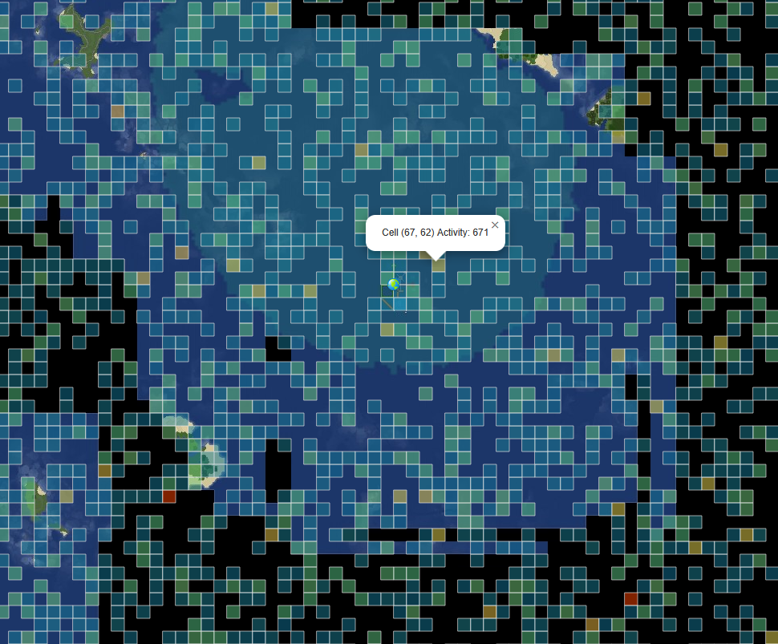
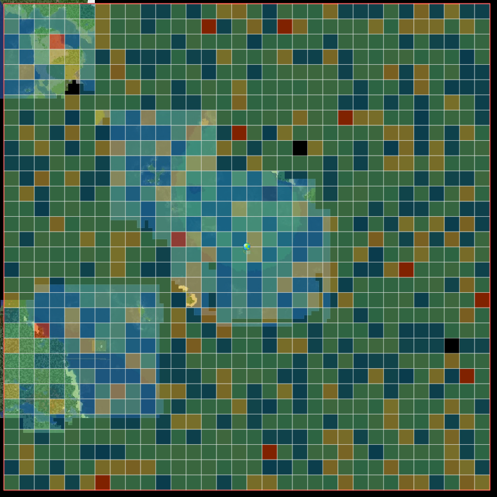
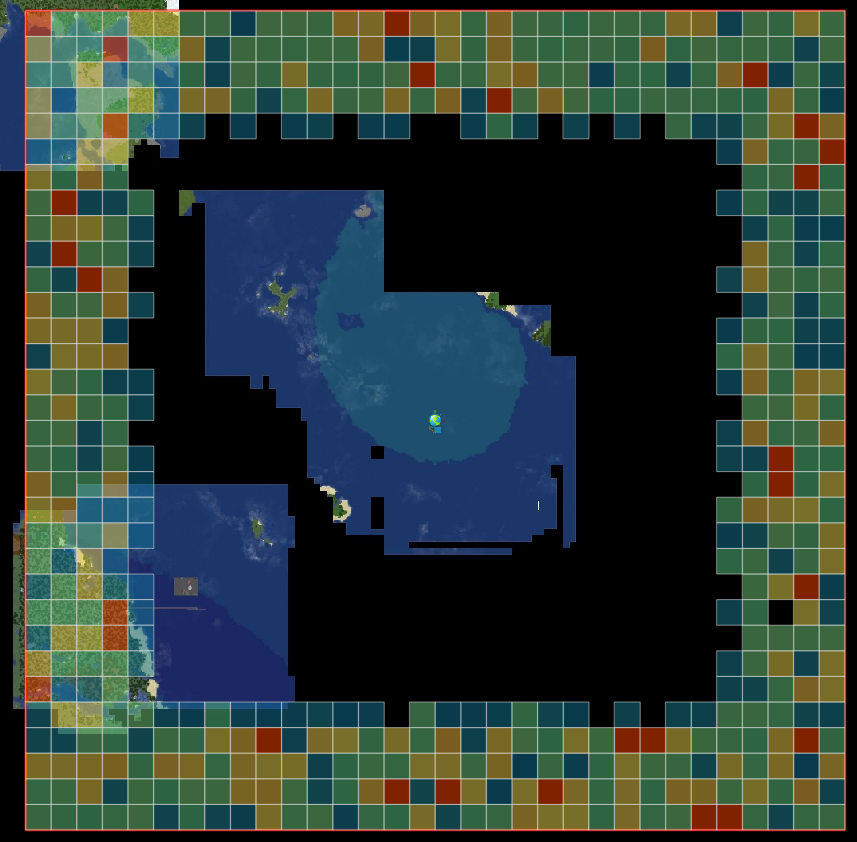
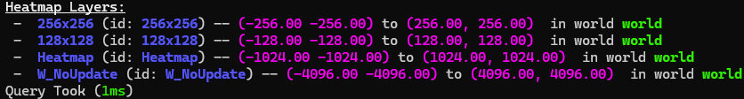
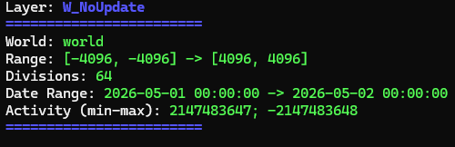
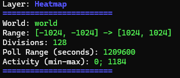
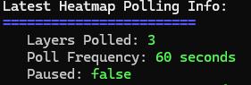
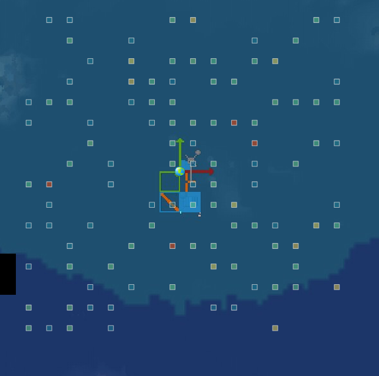
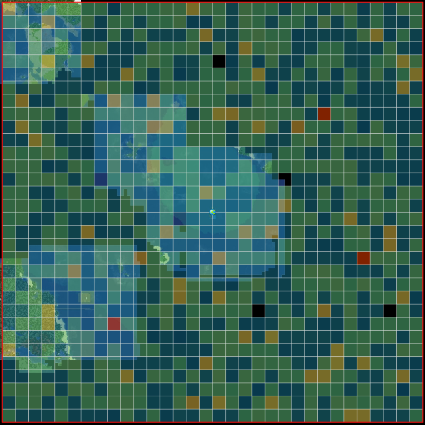

# MMHeatmap

## Purpose:
The goal is to save time for players using the dynmap so they can select, or at least find less densely populated areas to get set up!
Additional, with resource worlds, it's easier to find areas which have yet to be looted!  

Display activity levels over a time period. Activity levels depends on weights defined in the config file.
For example "placeBlock" is worth 1 activity by default. 

(forgive my ugly looking map, it was created using fake player data)

## Features: 
- Modifiable Poll Frequency (i.e. How often the heatmap should update) -- "defaults.pollFrequencySeconds"
- Modifiable Poll Size (i.e. How many chunks to group actions into) -- "defaults.pollAreaChunkSize"
- Density Warnings (i.e. How many heatmap cells is too much) -- "defaults.divisionDensityWarningCount"
- Modifiable Heatmap Activity Gradient -- "colors.cellActivityGradient"
- Modifiable Color And Opacity Settings -- "colors"
- Togglable Action Weights (0 = disable) -- Examples:
  - "activityWeights.playerPlace"
  - "activityWeights.playerChangeBeaconEffect"
  - "activityWeights.playerSetSpawn"
  - Among others which may potentially indicate player activity!

## Commands:
### Parent Branch:
 - /mmheatmap
   - create
   - delete
   - info
   - modify
   - poll
   - resync
   - generateFakeData
   - benchmark

### "create" Branch:
- divideWorld -- This tells the plugin to create a layer that's simply divided into multiple segments between 2 (x,y) points
  - example: /mmheatmap create divideWorld "layer_name" -1024 -1024 1024 1024 32 "1w" world
  - breakdown:
    - /mmheatmap -- parent command
    - create -- create branch
    - divideWorld -- this tells the plugin to regularly update the layer (time between updates found in config.yml -- "defaults.pollFrequencySeconds")
    - "layer_name" -- what the layer will be called and what it will show up as on dynmap
    - -1024 -1024 1024 1024 -- x1 y1 x2 y2
    - 32 -- how many divisions to make along each axis
    - "1w" -- how much time to include on the heatmap, 1 week in this case. Each time the layer is polled, it will get data from the range of: {Now-(however long the time period was set to) -> Now}
    - world -- what world to add the heatmap to
    - 
      - In this example, fake player data already existed to show the results
- divideWorldNoUpdate
  - example: /mmheatmap create divideWorldNoUpdate "layer_name" -1024 -1024 1024 1024 32 "2026-01-01 00:00:00" "2026-04-16 00:00:00" world
  - breakdown:
    - Many of the same parameters from "divideWorld" exist here, so they will be skipped
    - "2026-01-01 00:00:00" -- (Jan 1st, 2026) When to start gathering player data from the activity database table 
    - "2026-04-16 00:00:00" -- (Apr 16th, 2026) When to stop gathering player data from the activity database table
      - The formatting must strictly follow this format: "yyyy-mm-dd hh:mm:ss"
    - world -- what world to add the heatmap to
- caveats:
  - This is executable from console, but it is automatically added to the default world rather than a user defined world
    - This will be fixed eventually to better support console based usage
    - In the meantime, to create a heatmap layer for a certain world, execute these commands as a player inside the desired worlds

### "delete" Branch:
 - layer
   - example: /mmheatmap delete layer "layer_name"
   - breakdown: this will simply delete the layer under the name "layer_name" from the database and remove it from the dynmap 
 - playerActivity
   - example: /mmheatmap delete playerActivity minecraft:overworld ALL_PLAYERS -750 -750 750 750 relativeTimePeriod "2w"
   - 
   - breakdown:
     - minecraft:overworld -- The world to delete the data from, because data belongs to a world, not a layer, a world is required rather than a layer name
     - ALL_PLAYERS -- This is a special case, it will remove all player data from an area, but a specific player name can also be put in this argument 
     - -750 -750 750 750
     - relativeTimePeriod -- The time mode to be used, relativeTimePeriod uses strings such as: "2w", "3d" (standing for 2 weeks and 3 days)
       - This parameter can also be dateRange, example: dateRange "2026-01-01 00:00:00" "2026-12-31 00:00:00"
     - "2w" -- a time string, this specifically stands for 2 weeks
    

### "info" Branch:
 - heatmapLayers
   - example: /mmheatmap info heatmapLayers 
   - 
 - layerInfo
   - example: /mmheatmap info layerInfo "layer_name"
   - 
   - 
 - pollInfo
   - example: /mmheatmap info pollInfo
   - 

### "modify" Branch:
 - "layer_name" -- you must first pick a layer to modify
   - dateRange -- only works on non-updating layers
     - example: /mmheatmap modify "layer_name" dateRange "2026-01-01 00:00:00" "2026-04-16 00:00:00"
     - breakdown: changes the non-updating layer to get data from the first date to the second date (inclusive)
   - divisions
     - example: /mmheatmap modify "layer_name" divisions 128
     - breakdown: changes the layer's division count, must be at least 1
       - caveats:
         - If a layer is too dense (i.e. small surface area and large amount of divisions) the heatmap layer will look more like points than cells
           - for example, a map with points -128 -128 to 128 128 (256 blocks square) with 64 divisions:
           - 
   - points
     - example: /mmheatmap modify "layer_name" points x1 y1 x2 y2
     - breakdown: changes the surface area of the layer to be from (x1,y1) to (x2,y2)
   - relativeTimePeriod -- only works on updating layers
     - example: /mmheatmap modify "layer_name" relativeTimePeriod "2d1h30m"
     - breakdown: changes the layer to have the past 2 days, 1 hour and 30 minutes of data (from time of polling)

### "poll" Branch:
 - pause: stops polling for all layers (currently only pauses until server reset or resumed)
 - resume: resumes polling for all layers
 - pollLayer:
   - example: /mmheatmap poll pollLayer "layer_name"
   - breakdown: polls the entire area of "layer_name"
 - pollArea
   - example: /mmheatmap poll pollArea "layer_name" x1 y1 x2 y2
   - breakdown: polls only the cells of the heatmap which are between the points (x1, y1) and (x2, y2)
     - caveat:
       - If you only have 1 heatmap division, this would be the same as polling the entire map

### "resync" Branch:
 - example: /mmheatmap resync
 - breakdown: if the plugin and the database become unsynced (for whatever reason), this will resynchronize them. This is also done on startup of the plugin

### "generateFakeData" Branch:
 - example: /mmheatmap generateFakeData "debugplayer" minecraft:overworld -2000 -2000 2000 2000 5000 200 10000
   - 
 - breakdown: 
   - "debugplayer" -- the name you want to insert into the database, may be a player name, but should be a unique name only used for testing
   - minecraft:overworld -- the world to add the data to
   - -2000 -2000 2000 2000 -- x1 y1 x2 y2
   - 5000 200 10000 -- data point count (how many data points to generate), minimum activity for a data point, maximum activity for a data point

### "reloadConfig" Branch:
 - this is as simple as: /mmheatmap reloadConfig, it will simply re-read the config file and try to apply changes becuase of the nature of some of the config options (specifically colors) it is considered an expensive operation. 
   With that being said, the map will repoll all layers to try and fix color changes in the config. This is done on a seperate thread, so it should not be too much to worry about, but there is no immidiate feedback.

### "benchmark" Branch:
- TODO: Implement

## Permissions
- /mmheatmap info
  - mmheatmap.help
- /mmheatmap info pollInfo 
  - mmheatmap.pollInfo
- /mmheatmap info layerInfo 
  - mmheatmap.layerInfo
- /mmheatmap create divideWorld .... 
  - mmheatmap.divideWorld
- /mmheatmap create divideWorldNoUpdate .... 
  - mmheatmap.divideWorld
- /mmheatmap delete layer ... 
  - mmheatmap.delete.layer
- /mmheatmap delete playerActivity ... 
  - mmheatmap.delete.playerActivity
- /mmheatmap poll pollLayer ... 
  - mmheatmap.poll.pollLayer
- /mmheatmap poll pollArea ... 
  - mmheatmap.poll.pollArea
- /mmheatmap poll pause 
  - mmheatmap.poll.pause
- /mmheatmap poll resume
  - mmheatmap.poll.resume
- /mmheatmap modify ... points ...
  - mmheatmap.modify.points
- /mmheatmap modify ... dateRange ...
  - mmheatmap.modify.dateRange
- /mmheatmap modify ... relativeTimePeriod ...
  - mmheatmap.modify.relativeTimePeriod
- /mmheatmap modify ... divisions ...
  - mmheatmap.modify.divisions
- /mmheatmap info heatmapLayers
  - mmheatmap.info.heatmapLayers
- /mmheatmap resync
  - mmheatmap.resync
- /mmheatmap generateFakePlayerData ...
  - mmheatmap.generateFakeData
- /mmheatmap reloadConfig
  - mmheatmap.reloadconfig
- /mmheatmap benchmark
  - TODO: Implement
- /mmheatmap ...
  - mmheatmap.root
